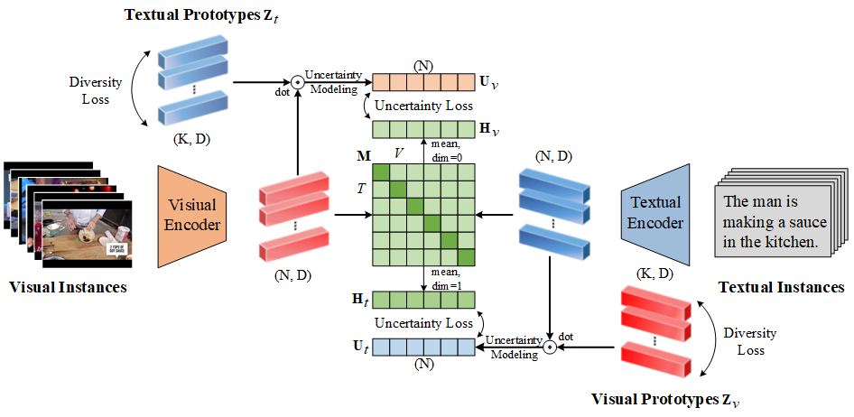

# PAU

## Introduction

The implementation for NeurIPS 2023 paper of ["Prototype-based Aleatoric Uncertainty Quantification for Cross-modal Retrieval."](https://openreview.net/pdf?id=ECRgBK6sk1). It is built on top of the [CLIP4Clip](https://github.com/ArrowLuo/CLIP4Clip) and the [X-CLIP](https://github.com/xuguohai/X-CLIP)


<!-- PAU Introdcution -->
<p align="center">
 
</p>

## Requirement

We recommend the following dependencies.

* Python 3.8
* [PyTorch](http://pytorch.org/) 1.7.1
* [NumPy](http://www.numpy.org/) (>1.19.5)
* [TensorBoard](https://github.com/TeamHG-Memex/tensorboard_logger)

```bash
pip install requirments.txt
```

## Dataset Preparation

We follow the same split provided by [CLIP4Clip](https://github.com/ArrowLuo/CLIP4Clip). You can follow the guide of its [Data preparing](https://github.com/ArrowLuo/CLIP4Clip#data-preparing).

### MSRVTT

The official data and video can be found [here](http://ms-multimedia-challenge.com/2017/dataset). 

You can download the splits and captions by:
```bash
wget https://github.com/ArrowLuo/CLIP4Clip/releases/download/v0.0/msrvtt_data.zip
```

### MSVD

The raw videos can be found [here](https://www.cs.utexas.edu/users/ml/clamp/videoDescription/).

You can download the splits and captions by:
```bash
wget https://github.com/ArrowLuo/CLIP4Clip/releases/download/v0.0/msvd_data.zip
```

### DiDeMo

The raw videos can be found [here](https://github.com/LisaAnne/LocalizingMoments). The splits can be found [here](https://github.com/albanie/collaborative-experts/blob/master/misc/datasets/didemo/README.md)


## Checkpoint

We provide the trained model files for evaluation. You can download the model trained on MSRVTT [here](https://drive.google.com/file/d/1ekZMz6S-Vf4RkIQ8SW_OGZnmvTSNCM2q/view?usp=drive_link), model trained on MSVD [here](https://drive.google.com/file/d/1ArI0NUCzqUGkCoVx72k3MRD4VLr0udls/view?usp=drive_link), and model trained on DiDeMo [here](https://drive.google.com/file/d/1scscUxoLeUBVT-6kDkNcRjIw25SO6P3U/view?usp=drive_link).

## Training

Please edit the ```${DATA_PATH}``` to the path of your dataset, and the ```${SAVE_PATH}``` to the path of the checkpoints where to save. 

***Tips:*** ```${do_rerank_learn}``` indicates whether to automatically learn the beta parameter of the model after each model training, which will take a longer time. You can remove it if you wish to speed up the validate process.

**MSR-VTT**

```bash
sh scripts/run_msrvtt.sh
```

**MSVD**

```bash
sh scripts/run_msvd.sh
```

**DiDeMo**

```bash
sh scripts/run_didemo.sh
```


## Rerank Beta Learning

If you want to get the best beta parameters of re-ranking (may take more time). Please edit the ```${DATA_PATH}``` to the path of your dataset, and the ```${SAVE_PATH}``` to the path of the checkpoints where to save. 

You can freely construct a beta learning set, but it is preferable that the data within it have not been used in previous model training process. Here, we default to using the validation set as the beta learning set.

**MSR-VTT**

```bash
sh scripts/run_msrvtt_learn.sh
```

**MSVD**

```bash
sh scripts/run_msvd_learn.sh
```

**DiDeMo**

```bash
sh scripts/run_didemo_learn.sh
```


## Evaluation

Please edit the ```${DATA_PATH}``` to the path of your dataset, the ```${SAVE_PATH}``` to the path of the checkpoints where to save, and the ```${MODEL_PATH}``` to the path of the checkpoints to be loaded. ```${rerank_coe_v}``` and ```${rerank_coe_t}``` are the rerank parameters ($\beta_1$, $\beta_2$) obtained in the Beta Learning Process.

**MSR-VTT**

```bash
sh scripts/run_msrvtt_eval.sh
```

**MSVD**

```bash
sh scripts/run_msvd_eval.sh
```

**DiDeMo**

```bash
sh scripts/run_didemo_eval.sh
```


## Reference

If you found this code useful, please cite the following paper:
```
@inproceedings{PAU,
  author    = {Hao Li and
               Jingkuan Song and
               Lianli Gao and
               Xiaosu Zhu and
               Heng Tao Shen},
  title     = {Prototype-based Aleatoric Uncertainty Quantification for Cross-modal Retrieval},
  booktitle = {NeurIPS},
  year      = {2023}
}
```
